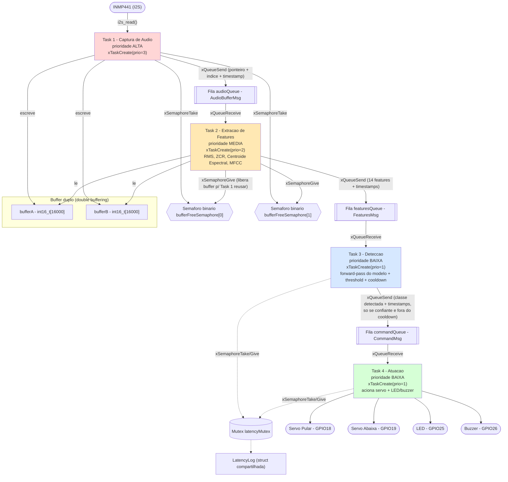
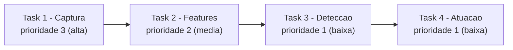

# Diagrama de Tarefas RTOS - Detector de Comandos de Voz

Arquitetura de 4 tasks FreeRTOS rodando no ESP32, implementada em
`firmware/dino_voice_controller/dino_voice_controller.ino`.

## Visao geral: tasks, filas, semaforos e mutex

## Para que serve cada mecanismo de sincronizacao

| Mecanismo | Entre quem | Por que existe |
|---|---|---|
| Fila `audioQueue` | Task 1 -> Task 2 | Handoff produtor/consumidor do buffer de audio cheio, sem polling - a Task 2 fica bloqueada em `xQueueReceive` ate ter dado novo. |
| Fila `featuresQueue` | Task 2 -> Task 3 | Mesma logica, entregando o vetor de 14 features ja calculado. |
| Fila `commandQueue` | Task 3 -> Task 4 | So recebe mensagem quando um comando e considerado valido (confianca acima do limiar e fora do cooldown) - desacopla a decisao da atuacao mecanica, que e mais lenta. |
| Semaforos binarios `bufferFreeSemaphore[0]` / `[1]` | Task 1 e Task 2 | Impedem que a Task 1 sobrescreva um buffer que a Task 2 ainda nao terminou de ler. Cada buffer so e reaproveitado depois que a Task 2 devolve o semaforo correspondente. Sem isso haveria condicao de corrida entre escrita (I2S) e leitura (extracao de features) no mesmo buffer. |
| Mutex `latencyMutex` | Task 3 e Task 4 | Unico recurso realmente compartilhado fora do fluxo das filas: o registro de latencia (`LatencyLog`) e lido e escrito por mais de uma task, entao precisa de exclusao mutua pra evitar leitura/escrita simultanea inconsistente. |

## Prioridades das tasks

A captura de audio tem a prioridade mais alta porque nao pode perder amostras
do I2S (a janela de 1 segundo e continua). A extracao de features vem em
seguida. Deteccao e atuacao dividem a prioridade mais baixa, ja que podem
tolerar um pequeno atraso sem comprometer a captura.
