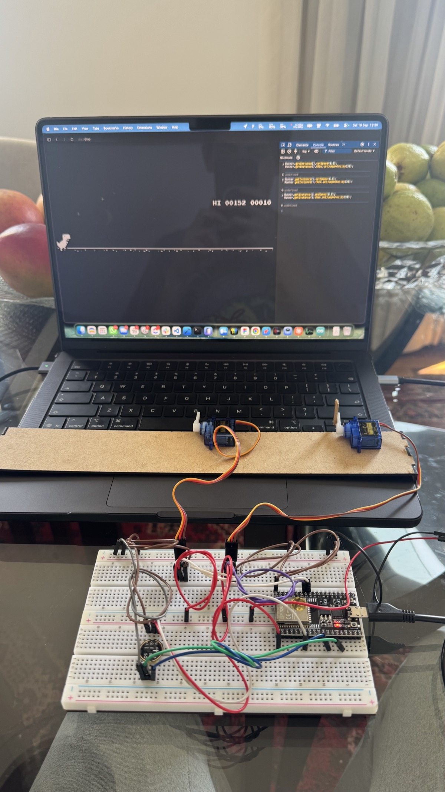
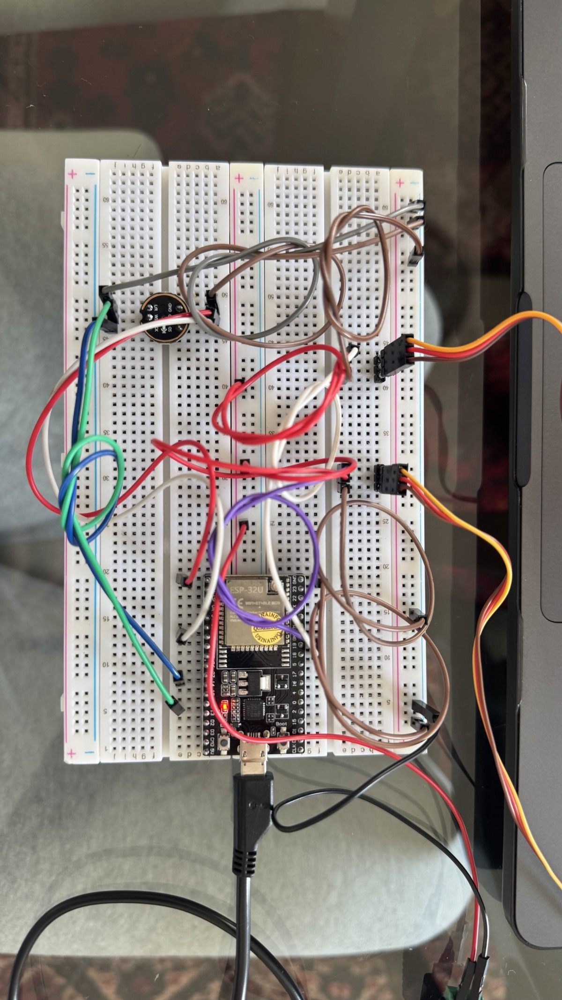
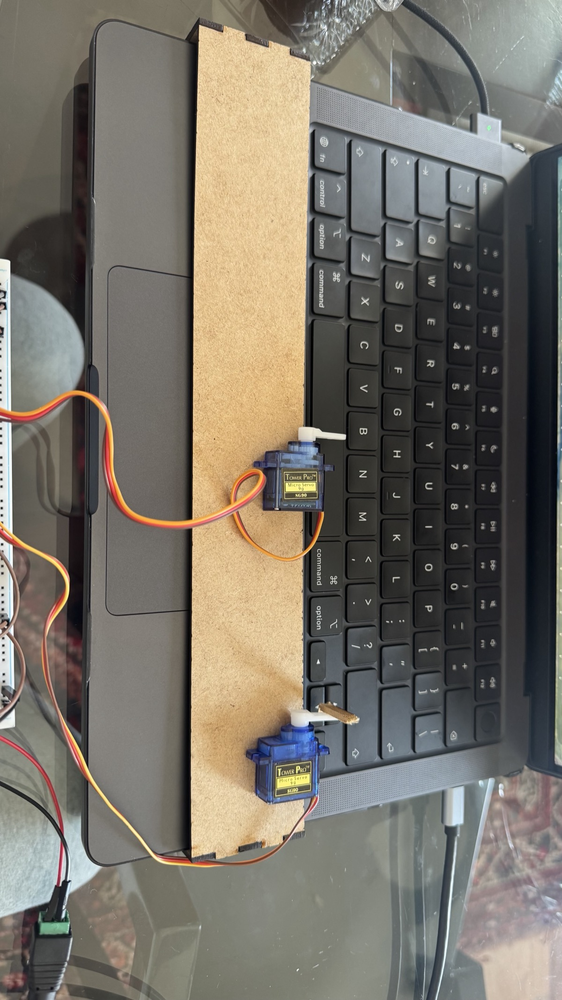
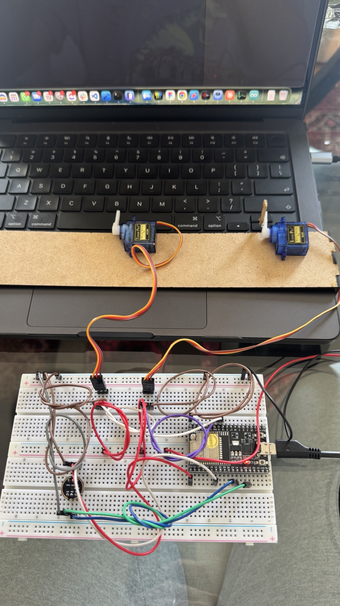

# Relatorio Tecnico - Detector de Anomalias Acusticas

**Disciplina:** Ponderada - Detector de Anomalias Acusticas
**Projeto:** controle por voz do jogo do dinossauro do Chrome, usando ESP32
+ INMP441 + FreeRTOS + servos.

Para o historico de desenvolvimento (o que foi tentado, o que deu errado, o
que funcionou), ver [`diario_de_bordo.md`](diario_de_bordo.md). Este
documento cobre a arquitetura, a metodologia e os resultados de forma mais
direta.

---

## 1. Objetivo e justificativa

O enunciado da ponderada permite escolher livremente qual padrao acustico
detectar. A escolha aqui foi reconhecer dois comandos de voz - "pular" e
"abaixa" - em vez de uma anomalia no sentido estrito (queda, grito, etc.),
com uma justificativa de aplicacao pratica: controle de um dispositivo sem
uso das maos (acessibilidade). O sistema aciona um servo motor que aperta
fisicamente a tecla correspondente do jogo do dinossauro do Chrome, tratando
cada comando como uma classe acustica a ser reconhecida, junto com uma
terceira classe de rejeicao ("ruido": silencio, ruido de fundo, outras
falas).

## 2. Arquitetura RTOS

O sistema roda como 4 tasks FreeRTOS no ESP32 (framework Arduino), descritas
em detalhe com diagrama em [`diagrama_rtos.md`](diagrama_rtos.md):

| Task | Prioridade | Responsabilidade |
|---|---|---|
| 1 - Captura de Audio | alta (3) | Le o I2S continuamente, preenche um buffer duplo (`bufferA`/`bufferB`, PCM int16, 16000 amostras = 1s a 16kHz) |
| 2 - Extracao de Features | media (2) | Recebe o buffer cheio, calcula RMS, Zero-Crossing Rate, Centroide Espectral e 11 coeficientes MFCC |
| 3 - Deteccao | baixa (1) | Roda o forward-pass do modelo, aplica threshold de confianca, piso minimo de RMS e cooldown entre comandos |
| 4 - Atuacao | baixa (1) | Aciona o servo correspondente e o LED de alerta |

**Sincronizacao entre tasks:**

- **3 filas** (`audioQueue`, `featuresQueue`, `commandQueue`) implementam o
  padrao produtor/consumidor entre tasks consecutivas, sem *polling* - cada
  task fica bloqueada em `xQueueReceive` ate ter dado novo.
- **2 semaforos binarios** (`bufferFreeSemaphore[0]` e `[1]`) protegem o
  buffer duplo de captura: a Task 1 so pode escrever num buffer depois que
  a Task 2 sinalizar (via `xSemaphoreGive`) que terminou de le-lo. Sem essa
  protecao haveria condicao de corrida entre a escrita continua do I2S e a
  leitura para extracao de features.
- **1 mutex** (`latencyMutex`) protege o unico recurso realmente
  compartilhado fora do fluxo das filas: uma struct (`LatencyLog`) com os
  timestamps de cada etapa, escrita tanto pela Task 3 quanto pela Task 4.

A prioridade da Task 1 e a mais alta porque a captura de audio nao pode
perder amostras; as demais tasks podem tolerar pequenas variacoes de tempo
sem comprometer o pipeline.

## 3. Pipeline de deteccao

### 3.1 Extracao de features

O vetor de entrada do modelo tem 14 valores: RMS, Zero-Crossing Rate,
Centroide Espectral e 11 coeficientes MFCC.

RMS e ZCR sao calculados diretamente no dominio do tempo. Centroide e MFCC
exigem uma FFT; em vez de usar os parametros padrao do `librosa` (FFT de
2048 pontos, 128 bandas mel - desenhados para uso em desktop), foi
implementada uma FFT radix-2 propria de 512 pontos com 26 bandas mel,
dimensionada para rodar em tempo real num microcontrolador. A mesma
formula foi escrita duas vezes: uma em Python (`training/dsp.py`, usada no
treino) e outra em C (`firmware/dino_voice_controller/fft.cpp` e
`feature_extraction.cpp`, usada no dispositivo). As duas implementacoes
foram verificadas numericamente uma contra a outra (nao contra o
`librosa`): o objetivo era garantir que o que roda no ESP32 calcula
exatamente o que o modelo aprendeu durante o treino, nao necessariamente
reproduzir uma biblioteca externa. Diferenca maxima observada: da ordem de
1e-4 a 1e-7 em testes com tons puros e com clipes reais do dataset.

Antes de calcular centroide e MFCC, o sinal e normalizado pelo pico de
amplitude. Isso torna essas duas features invariantes ao ganho do
microfone/dispositivo de gravacao. O RMS, ao contrario, e calculado sobre o
sinal bruto (sem essa normalizacao), porque e a feature que carrega
informacao de volume - necessaria para distinguir fala de silencio/ruido de
fundo.

### 3.2 Modelo

Rede neural totalmente conectada pequena: 14 (entrada) -> 16 (oculta, ReLU)
-> 3 (saida, softmax). Total de 291 parametros (~1.16KB em float32).
Treinada em Python com PyTorch e exportada para `.onnx`
(`models/model.onnx`).

Como o ESP32 nao tem um runtime ONNX embarcado simples de usar em conjunto
com FreeRTOS/Arduino, o forward-pass foi portado manualmente para C como
produto de matrizes (`firmware/dino_voice_controller/model_inference.cpp`),
usando os pesos extraidos do `.onnx` (`training/export_c_model.py`). A
porta foi verificada comparando os logits calculados em C com os calculados
pelo `onnxruntime` em Python, para o mesmo vetor de entrada: diferenca na
ordem de 1e-5.

Dado o tamanho da rede (291 parametros), nao foi feita quantizacao: o ganho
de memoria seria inferior a 1KB, irrelevante frente aos ~520KB de RAM do
ESP32, e o forward-pass ja roda em microssegundos em ponto flutuante.

## 4. Metodologia experimental

### 4.1 Dataset

O dataset final usado para o modelo em producao contem 142 clipes de audio
de 1 segundo (16kHz, mono, PCM 16 bits), gravados diretamente pelo
microfone INMP441 do dispositivo final, via um utilitario de gravacao
proprio (`firmware/esp32_record/esp32_record.ino` +
`training/record_from_esp32.py`, comunicacao por Serial):

- 49 clipes de "pular"
- 43 clipes de "abaixa"
- 50 clipes de "ruido" (silencio, ruido de fundo, outras falas)

O dataset e ampliado por augmentacao (ruido aditivo, variacao de pitch,
*time-stretch*, variacao de ganho, deslocamento temporal) antes do treino,
sempre aplicada *depois* da separacao treino/teste, para nao vazar
informacao entre os dois conjuntos (um clipe aumentado nunca aparece em
treino e teste ao mesmo tempo).

Dataset intermediarios (audio gravado por iPhone/notebook e dados publicos
do MLCommons Multilingual Spoken Words Corpus) foram usados em etapas
anteriores do projeto e estao documentados no diario de bordo; foram
descartados do modelo final porque um experimento controlado mostrou que
misturar fontes de microfone diferentes prejudicava a generalizacao para o
hardware real (ver secao 6).

### 4.2 Divisao treino/teste

Separacao 80/20 (`training/dataset.py`, funcao `split_raw_clips`), feita
sobre os clipes brutos, antes de qualquer augmentacao, com estratificacao
por classe. Seed fixa (42) em todas as etapas aleatorias (split, inicializacao
dos pesos da rede) para tornar o resultado reprodutivel.

### 4.3 Codigo de teste

- **Avaliacao offline:** `training/train.py` treina e avalia o modelo,
  gerando a matriz de confusao e o relatorio de precisao/recall/F1 usados
  na secao 5 (`models/evaluation.txt`).
- **Teste ao vivo:** `training/live_test.py` roda o modelo em tempo real
  pelo microfone do computador (janela deslizante de 1s, classificacao
  continua), util para depuracao rapida sem precisar regravar o firmware.
- **Suite automatizada:** 62 testes unitarios (`training/tests/`, `pytest`)
  cobrindo extracao de features, augmentacao, dataset, treino, exportacao
  para ONNX/C e o utilitario de gravacao.

## 5. Analise de latencia

Cada etapa do pipeline e medida com `micros()`/`millis()` e registrada numa
struct compartilhada (protegida por mutex, ver secao 2), impressa via
Serial a cada comando detectado. Exemplo real, capturado em bancada:

```
[PULAR] captura->features=84838us  features->deteccao=45us  deteccao->atuacao=230030us  total=314901us
```

| Etapa | Tempo tipico | Composicao |
|---|---|---|
| Captura -> Features | ~85 ms | FFT (512 pontos) + banco de filtros mel + DCT, repetidos para ~61 janelas dentro do clipe de 1s |
| Features -> Deteccao | < 1 ms | Forward-pass da rede (291 parametros) - custo desprezivel frente as demais etapas |
| Deteccao -> Atuacao | ~230 ms a ~1080 ms | Pulso do LED de alerta (80ms) + tempo que o servo fica pressionado (parametro ajustavel por comando: 300ms para "pular", 1000ms para "abaixa") |

A etapa dominante em tempo de processamento e a extracao de features
(FFT), mas o maior componente de latencia *percebida* pelo usuario nao
aparece nessa tabela: a Task 1 so envia um buffer para processamento depois
de acumular o segundo inteiro de audio. Na pior das hipoteses, o sistema so
comeca a processar ate 1 segundo depois do inicio da fala - esse tempo de
captura domina a latencia total, mais do que qualquer etapa de calculo.

## 6. Resultados

Avaliacao offline no conjunto de teste (dados reais do INMP441, 29 clipes,
nunca vistos durante o treino nem gerados por augmentacao a partir de
clipes de treino):

```
              precision    recall  f1-score   support

       ruido       0.75      0.90      0.82        10
       pular       1.00      0.90      0.95        10
      abaixa       0.75      0.67      0.71         9

    accuracy                           0.83        29
```

Matriz de confusao (linhas = classe real, colunas = classe prevista, ordem
ruido/pular/abaixa):

```
[[9 0 1]
 [0 9 1]
 [3 0 6]]
```

"Pular" tem precisao de 100% nesse conjunto de teste (nenhum outro clipe foi
classificado como "pular" incorretamente). O erro mais frequente e "abaixa"
confundido com "ruido" (3 dos 9 casos) - um erro relativamente seguro do
ponto de vista do produto final, ja que resulta em nenhuma acao, em vez de
acionar o servo errado.

Um experimento comparativo, descrito em detalhe no diario de bordo, treinou
o mesmo pipeline com um dataset publico em ingles (Google Speech Commands,
palavras "up"/"down") e obteve 86% de acuracia num conjunto de teste de 101
amostras. O resultado mais alto e mais estatisticamente confiavel (dataset
maior, gravado por milhares de falantes) confirma que a principal limitacao
do modelo atual e o tamanho do dataset proprio, nao a arquitetura do
pipeline em si.

## 7. Discussao

**Descasamento de microfone.** O desafio tecnico central do projeto nao foi
a arquitetura RTOS (que funcionou como planejado desde a primeira versao),
mas garantir que os dados de treino representassem o microfone do
dispositivo final. Um modelo treinado com audio de outros microfones
(celular, notebook, dataset publico) apresentava um vies forte e
consistente para uma unica classe quando testado ao vivo pelo INMP441,
mesmo com acuracia alta na avaliacao offline (que usava dados da mesma
fonte de microfone do treino). Um experimento controlado - treinar e
testar usando exclusivamente dados gravados pelo proprio ESP32 - eliminou
esse vies quase por completo, confirmando que a causa era descasamento de
dominio, e nao um erro de modelo ou de features.

**Redes pequenas fora da distribuicao de treino.** Em testes com o modelo
recebendo silencio digital "perfeito" (nunca presente no dataset de
treino, ja que toda gravacao real tem algum ruido de fundo), a rede
classificou o silencio como um comando valido com mais de 99% de
confianca. Esse comportamento - confianca alta em entradas fora da
distribuicao vista no treino - e um limite conhecido de redes neurais
pequenas sem nenhum mecanismo de rejeicao explicito. A mitigacao adotada
foi um piso minimo de RMS (calibrado empiricamente em bancada, ver
`MIN_RMS_FLOOR` no firmware) que rejeita qualquer janela abaixo de um
limiar de energia antes mesmo de rodar o modelo.

**Qualidade de dados publicos.** Uma auditoria manual (com apoio de
transcricao automatica via Whisper) sobre o Multilingual Spoken Words
Corpus revelou uma taxa de erro de alinhamento maior que a esperada -
clipes rotulados como uma palavra que na verdade continham outra coisa, ou
apenas ruido. Isso reforça que dado publico automaticamente rotulado
precisa de auditoria antes de ser incorporado a um dataset de treino,
mesmo vindo de uma fonte reconhecida.

**Limitacoes conhecidas:**

- Dataset final pequeno (142 clipes brutos) para um problema de
  reconhecimento de fala; a acuracia de 83% tem variancia relevante dado o
  tamanho do conjunto de teste (29 amostras).
- O piso de RMS usado para rejeitar silencio/ruido e um valor fixo,
  calibrado manualmente em um ambiente especifico; pode exigir reajuste em
  outras condicoes de ruido ambiente ou outro posicionamento do microfone.
- "Pular" e "abaixa" ainda apresentam confusao entre si em falas mais
  rapidas ou mais baixas.

**Trabalho futuro:** ampliar o dataset gravado diretamente pelo hardware
final (foi o que mais melhorou o resultado ate agora); considerar uma
segunda rodada de calibracao do piso de RMS e do limiar de confianca com
mais dados de bancada; investigar se caracteristicas adicionais de
temporalidade (sem cair no problema de dimensionalidade ja observado com a
segmentacao testada e descartada) ajudariam a separar melhor "pular" de
"abaixa".

## 8. Estrutura do repositorio

- `firmware/` - codigo do ESP32 (Arduino): sketch principal
  (`dino_voice_controller/`), teste isolado de microfone (`i2s_mic_test/`)
  e utilitario de gravacao de dados (`esp32_record/`).
- `training/` - pipeline de treino em Python (features, augmentacao,
  treino, exportacao para ONNX e para C), com testes automatizados.
- `models/` - modelo treinado (`model.onnx`), estatisticas de normalizacao
  usadas para padronizar as features, e relatorio de avaliacao.
- `docs/` - este relatorio, o diario de bordo, o diagrama RTOS e a spec de
  arquitetura original.

## 9. Referencias e licencas

- Multilingual Spoken Words Corpus (MLCommons), licenca CC-BY 4.0,
  <https://mlcommons.org/datasets/multilingual-spoken-words/> - usado em
  etapa intermediaria do projeto (ver diario de bordo), nao faz parte do
  dataset do modelo final.
- Google Speech Commands Dataset v0.02, licenca CC-BY 4.0 - usado no
  experimento comparativo da secao 6.

## 10. Demonstracao

### Montagem fisica do hardware



*Legenda: visao geral da bancada de teste - notebook com o jogo do
dinossauro do Chrome aberto, os dois servos SG90 apoiados sobre o teclado
(um proximo a barra de espaco, outro proximo a seta para baixo) e o
circuito na protoboard, conectado por USB.*



*Legenda: detalhe do circuito - modulo ESP32-WROOM-32U, microfone I2S
INMP441 (modulo redondo) e a fiacao de sinal dos dois servos.*



*Legenda: os dois servos SG90 (Tower Pro) fixados numa tira de MDF apoiada
sobre o teclado do notebook, cada um posicionado para pressionar uma tecla
diferente do jogo.*



*Legenda: outro angulo da montagem, mostrando os servos e o circuito
completo na mesma foto.*

<!-- ESPACO PARA VIDEO -->
### [Video: demonstracao do sistema em funcionamento]
*Legenda: video mostrando o comando de voz "pular"/"abaixa" acionando o
jogo do dinossauro do Chrome em tempo real, via ESP32 + servos.*

<!-- inserir video aqui (arquivo ou link) -->
